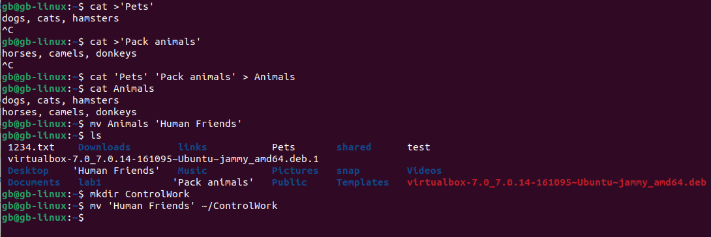

Михайлова Е.А.
19.04.2024
5275(или 5276)

1. Использование команды cat в Linux
   - Создать два текстовых файла: "Pets"(Домашние животные) и "Pack animals"(вьючные животные), используя команду `cat` в терминале Linux. В первом файле перечислить собак, кошек и хомяков. Во втором — лошадей, верблюдов и ослов.
   - Объединить содержимое этих двух файлов в один и просмотреть его содержимое.
   - Переименовать получившийся файл в "Human Friends"

_*Пример конечного вывода после команды “ls” :*_

_Desktop Documents Downloads  HumanFriends.txt  Music  PackAnimals.txt  Pets.txt  Pictures  Videos_

2. Работа с директориями в Linux
   - Создать новую директорию и переместить туда файл "Human Friends".

   

3. Работа с MySQL в Linux. “Установить MySQL на вашу вычислительную машину ”
   - Подключить дополнительный репозиторий MySQL и установить один из пакетов из этого репозитория.

sudo wget https://dev.mysql.com/get/mysql-apt-config_0.8.23-1_all.deb

sudo dpkg -i mysql-apt-config_0.8.23-1_all.deb

sudo apt-get update

sudo apt-get install mysql-server

4. Управление deb-пакетами
   - Установить и затем удалить deb-пакет, используя команду `dpkg`.

sudo wget https://download.docker.com/linux/ubuntu/dists/jammy/pool/stable/amd64/docker-ce-cli_20.10.13~3-0~ubuntu-jammy_amd64.deb

sudo dpkg -i docker-ce-cli_20.10.133-0ubuntu-jammy_amd64.deb

sudo dpkg -r docker-ce-cli

5. История команд в терминале Ubuntu
   - Сохранить и выложить историю ваших терминальных команд в Ubuntu.
В формате: Файла с ФИО, датой сдачи, номером группы(или потока)

6. Диаграмма классов
   - Создать диаграмму классов с родительским классом "Животные", и двумя подклассами: "Pets" и "Pack animals".

    В составы классов, которых в случае Pets войдут классы: собаки, кошки, хомяки, а в класс Pack animals войдут: Лошади, верблюды и ослы).
Каждый тип животных будет характеризоваться (например, имена, даты рождения, выполняемые команды и т.д)
Диаграмму можно нарисовать в любом редакторе, такими как Lucidchart, Draw.io, Microsoft Visio и других.

Task1_6_Diagram.png

